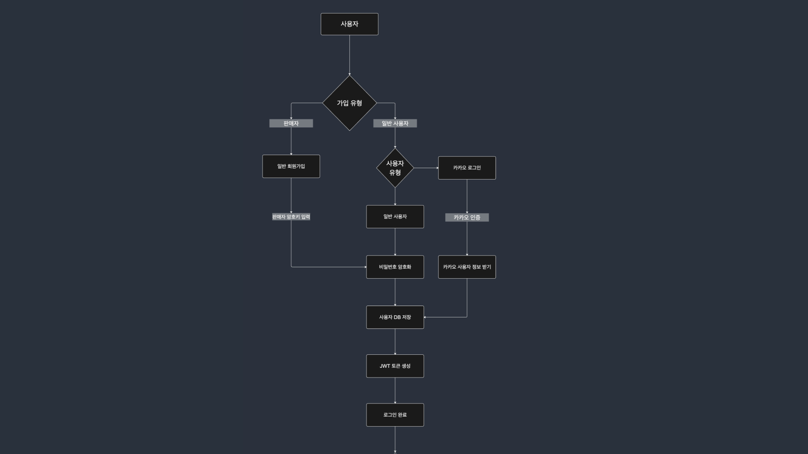
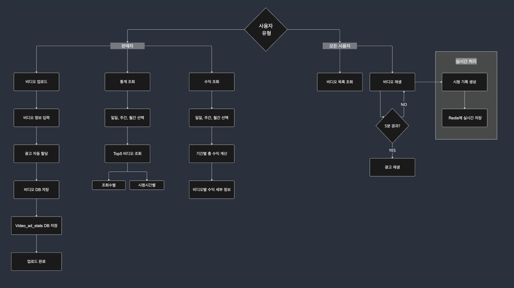
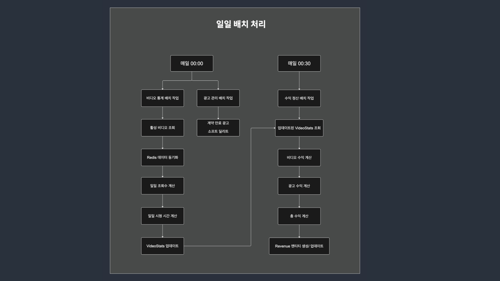
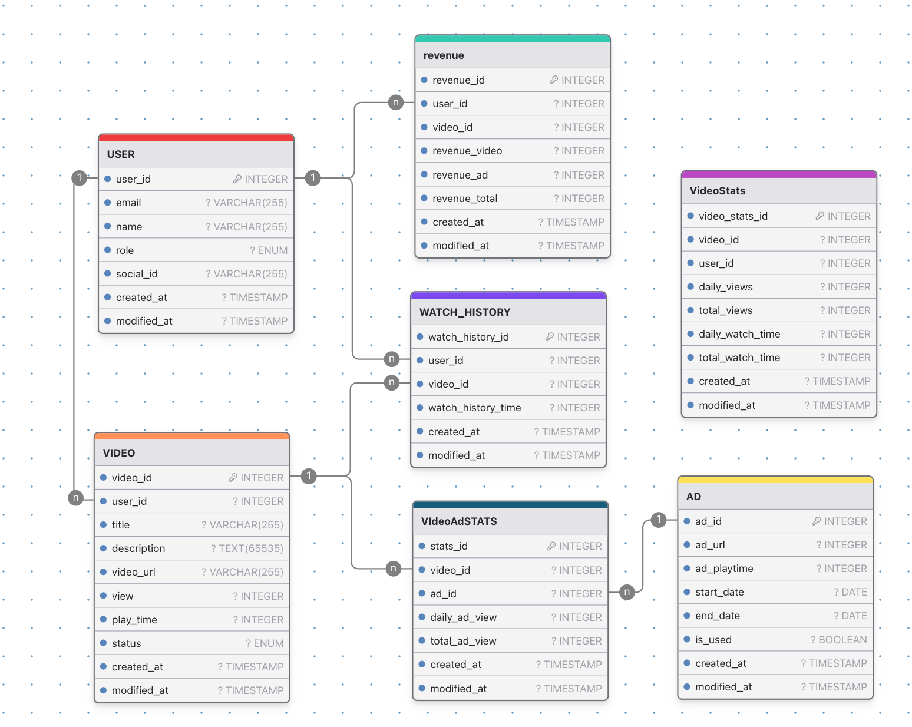

# 정산시스템 프로젝트

## 프로젝트 소개
동영상 플랫폼의 수익 정산을 위한 배치 처리 시스템

비디오 조회수 통계를 생성하고, 이를 기반으로 광고 수익을 계산하여 정산 데이터를 자동으로 생성하는 Batch 작업 프로젝트

## 기술 스택

## 프로세스 플로우

## 프로젝트 주요 기능 
1. 판매자 회원가입 & 카카오 로그인
   <table>
     <tr>
       <td></td>
       <td></td>
     </tr>
   </table>

2. 비디오 업로드시 광고 자동 할당

3. 비디오 조회수 통계 생성
  
4. 비디오 조회수 및 광고 조회수에 대한 수익 정산

## 프로젝트 경험
### 1. 배치 작업 성능 개선 내용( 추후 작성 예정)

### 📊 최종 성능

N건 기준 실측 결과: --

### 📈 성능 개선 추이

| 단계 | 데이터 규모 | 처리 시간 | 개선율 |
|------|------------|-----------|--------|
| 모놀리식 | N 건 | N분+ | - |
| 멀티 모듈 | N 건 | N분 | --%+ ↓ |
| 1차 최적화 | N 건 | N분 | --% ↓ |
| 2차 최적화 | N 건 | N분 | --% ↓ |
| 3차 최적화 | N 건 | N분 | --% ↓ |

### 2. 트러블 슈팅

## 프로젝트 상세

### API 문서

[Postman API 명세서](https://documenter.getpostman.com/view/37736920/2sAXjQ1VVz)

## ERD

